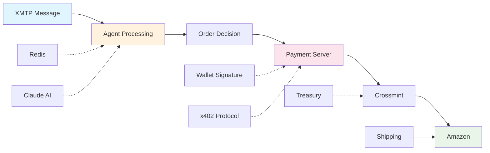

# Build your own Worldstore Agent

**Build a production-ready crypto-commerce platform that enables Amazon purchases through AI-powered conversations using USDC payments.**

Having followed this tutorial, you'll have a working system where users can chat with an AI agent to buy Amazon products using cryptocurrency.

## Tutorial Navigation

**Complete Tutorial Series:**
1. **[System Overview](./1-overview.md)** (this file) - Architecture and components
2. **[Quick Deployment](./2-deployment.md)** - Get up and running with the agent
3. **[Production Guide](./3-production.md)** - Security, scaling, and compliance
4. **[Troubleshooting](./4-troubleshooting.md)** - Debug common issues
5. **[Extensions](./5-extensions.md)** - Advanced features and enhancements

## Table of Contents

1. [System Architecture Overview](#system-architecture-overview)
2. [Prerequisites & Environment Setup](#prerequisites--environment-setup)
3. [Component Deep Dive](#component-deep-dive)
5. [Payment Flow End-to-End](#payment-flow-end-to-end)
6. [User Experience Walkthrough](#user-experience-walkthrough)
7. [What's Next](#whats-next)

---

## System Architecture Overview

The Worldstore Agent is a monorepo containing two symbiotic services that create a seamless crypto-to-commerce experience:

### The Big Picture

```
User Message -> XMTP Agent -> AI Processing -> Product Search -> Order Creation -> x402 Payment -> Amazon Fulfillment
```

But here's what actually happens under the hood:

**XMTP Agent** (`/agent/`) - The conversational brain
- **Core**: Claude Sonnet 4 powered shopping assistant
- **Protocol**: [XMTP](https://docs.xmtp.org/) for decentralized messaging
- **Storage**: Redis for user profiles (or any persisting storage)
- **AI Framework**: LangGraph for complex conversation flows
- **Wallet Generation**: Deterministic wallets for gasless payments

**x402 Payment Server** (`/server/`) - The payment facilitator
- **Protocol**: Custom x402 implementation for gasless transactions
- **Integration**: Crossmint API for Amazon order placement

### What Makes This Special

This isn't just another crypto payment processor. Three architectural decisions make it production-ready:

1. **Gasless UX**: Users sign EIP-3009 permits instead of paying gas fees
2. **Deterministic Wallets**: No wallet setup
3. **Natural Language**: Complex e-commerce through simple conversation

---

## Prerequisites & Environment Setup

### System Requirements

- **Node.js 20+** - The foundation everything runs on
- **pnpm 8+** - Workspace management (faster than npm/yarn)
- **Redis Stack** - User state and conversation memory
- **Git** - For deployment and version control

### Required Accounts & API Keys

You need five essential accounts before starting:

1. **Anthropic API** - For Claude Sonnet 4 AI model
2. **Crossmint Account** - For Amazon order fulfillment
3. **SerpAPI** - For Amazon product search
4. **Redis Cloud** - Or local Redis instance. You need a redis direct connection url either from local instance or cloud
5. **Blockchain RPC Provider** - For wallet operations

### Quick Environment Check

```bash
# Verify your system is ready
node --version    # Should be 20+
pnpm --version   # Should be 8+
redis-cli ping   # Should return PONG; only required if running redis-cli locally
```

If any of these fail, fix them before continuing. The system won't work with missing dependencies.

> **Base Wallet Integration Note**
>
> This XMTP bot is optimized for Coinbase's Base Wallet, leveraging two specialized content types that enhance the chat experience:
>
> - **Quick Actions codec**: Enables interactive buttons and commands within chat
> - **Intent codec**: Handles transaction intents and wallet interactions
>
> While your bot works with any XMTP client, Base Wallet users get the full interactive experience with these enhanced message types.
>
> **Learn more**: Complete codec documentation and implementation examples at [Base App Chat Agents Guide](https://docs.base.org/base-app/guides/chat-agents#base-app-content-types)

---

## Component Deep Dive

### XMTP Agent Architecture

The agent is built around a central orchestration class with specialized helpers:

**XMTPShoppingBot** ([`index.ts`](./agent/index.ts)) - Main orchestrator
- Initializes all helper classes
- Manages XMTP client lifecycle
- Routes messages to appropriate handlers
- Coordinates agent responses

**Key Helper Classes:**

```typescript
// Core conversation processing
ConversationProcessor  // Routes messages to correct AI agent
                      // -> agent/helpers/conversationProcessor.ts

UserStateManager      // Tracks user context and funding requirements
                     // -> agent/helpers/userStateManager.ts

ActionMenuFactory     // Creates interactive UI elements
                     // -> agent/helpers/actionMenuFactory.ts

// Wallet & Payment Operations
WalletOperationsHandler // Manages balance checks and funding requests
                       // -> agent/helpers/walletOperationsHandler.ts

OrderToolWrapper       // Wraps order placement with payment logic
                      // -> agent/helpers/orderToolWrapper.ts

// XMTP Protocol Management
XMTPClientFactory      // Handles client creation and message streaming
                      // -> agent/helpers/xmtpClientFactory.ts
```

**Direct File Links:**
- [`ConversationProcessor`](./agent/helpers/conversationProcessor.ts)
- [`UserStateManager`](./agent/helpers/userStateManager.ts)
- [`ActionMenuFactory`](./agent/helpers/actionMenuFactory.ts)
- [`WalletOperationsHandler`](./agent/helpers/walletOperationsHandler.ts)
- [`OrderToolWrapper`](./agent/helpers/orderToolWrapper.ts)
- [`XMTPClientFactory`](./agent/helpers/xmtpClientFactory.ts)

**AI Agent System:**

The system uses two specialized LangGraph agents:

1. **Shopping Agent** ([`shopping/agent.ts`](./agent/lib/agents/shopping/agent.ts)) - Natural product search and ordering
2. **Profile Agent** ([`profile/agent.ts`](./agent/lib/agents/profile/agent.ts)) - User profile management and preferences

Each agent has custom tools, prompts, and conversation flows optimized for their domain.

**Agent Tools:**
- [`Order Tools`](./agent/lib/tools/order.ts) - Product search and order placement
- [`Profile Tools`](./agent/lib/tools/profile.ts) - User profile management
- [`Onchain Tools`](./agent/lib/tools/onchain.ts) - Wallet operations and balance checks

> **Network Simplification:** While the payment server supports multiple networks, the XMTP agent is configured to work primarily with Base Sepolia and USDC on Base Sepolia for simplicity. This reduces complexity in wallet operations and balance checks while maintaining the core functionality. Additional networks can be added by extending the onchain tools and wallet configuration.

### x402 Payment Server Architecture

The payment server implements a custom x402 facilitator pattern:

**Core Components:**

```javascript
// Server foundation
server.js          // Express app with x402 middleware
                  // -> server/src/server.js

config/index.js    // Multi-network configuration management
                  // -> server/src/config/index.js

// Business logic
routes/orders.js   // Order creation and status endpoints
                  // -> server/src/routes/orders.js

services/crossmint.js  // Amazon order placement via Crossmint
                      // -> server/src/services/crossmint.js

// Supporting infrastructure
utils/logger.js    // Structured logging for debugging
                  // -> server/src/utils/logger.js
```

**Direct File Links:**
- [`server.js`](./server/src/server.js) - Express app with x402 middleware
- [`config/index.js`](./server/src/config/index.js) - Multi-network configuration
- [`routes/orders.js`](./server/src/routes/orders.js) - Order endpoints
- [`services/crossmint.js`](./server/src/services/crossmint.js) - Crossmint integration
- [`utils/logger.js`](./server/src/utils/logger.js) - Logging utilities

> **Network Configuration Note:** The payment server supports multi-network configuration for USDC across Ethereum, Base, Polygon, and Arbitrum testnets. However, the XMTP agent currently manages only Base Sepolia and USDC on Base Sepolia to keep the implementation simpler. This can be easily extended to support additional networks as needed.

> **💡 Multi-Currency Payment Support**
>
> **Current limitation**: x402 protocol restricts payments to EIP-3009 tokens (USDC only). For multi-currency support, you'll need to bypass x402.
>
> **The details**:
> - x402 enables gasless payments but only supports USDC
> - Crossmint APIs are chain/token agnostic—they work with any token you throw at them
> - To accept other tokens: remove the 402 server response code and let API calls go through directly
>
> **Implementation**: Skip the x402 middleware for multi-currency flows. Your users will handle gas fees, but you gain full token flexibility.
>
> **Need help with this setup?** [Contact our team](https://t.me/crossmintdevs)—we've helped other developers implement multi-currency flows and can walk you through the specifics.

**Payment Flow Design:**

1. **Initial Request** - Client sends order without payment
2. **402 Response** - Server returns payment requirements
3. **Payment Retry** - Client includes x402 payment header
4. **Order Fulfillment** - Server processes payment and places Amazon order

### System Sequence Flow


***Yes, that sequence diagram looks like a distributed systems horror story at first glance, we get it. Nine different services for buying earbuds feels like overkill until you realize each one handles exactly one thing well, and the magic happens in the orchestration. The complexity is all hidden behind simple conversation, which is exactly the point.***


### Data Flow Between Services



The beauty is in the orchestrationeach component handles its specialized role while maintaining the illusion of simple conversation.

---


## Payment Flow End-to-End

Understanding the payment flow is crucial for debugging and extending the system. Here's what happens when a user wants to buy something:

### Step 1: Order Initiation

**User Action:** "I want to buy AirPods Pro"

```
1. User sends [XMTP](https://docs.xmtp.org/) message
2. Agent processes with Claude AI
3. SerpAPI searches Amazon for products
4. Agent presents options with prices
5. User confirms selection
```

**Behind the scenes:**
- Agent calls `search_product` tool with user's query
- SerpAPI returns Amazon product data (ASIN, price, reviews)
- Agent formats response with product details and order button

### Step 2: Payment Preparation

**User Action:** Clicks "Buy Now" button

```
1. Agent checks user profile completeness
2. Agent calls `order_product` tool
3. System generates deterministic wallet for user
4. Agent checks USDC balance across networks
5. If insufficient funds, requests funding
```

**The wallet magic:**
```typescript
// Deterministic wallet generation
const userWallet = generateUserWallet(userInboxId, masterPrivateKey);
// Same inbox ID always generates the same wallet
// No seed phrases, no wallet apps, no complexity

// Implementation:
// -> agent/helpers/generateUserPrivateKey.ts
// -> agent/helpers/getWalletClientForUser.ts
// -> agent/helpers/wallet.ts (createUserWallet)
```

**Implementation Details:**
- [`generateUserPrivateKey.ts`](./agent/helpers/generateUserPrivateKey.ts) - Creates deterministic private keys using SHA256(masterKey + inboxId)
- [`getWalletClientForUser.ts`](./agent/helpers/getWalletClientForUser.ts) - Main function that orchestrates wallet creation
- [`wallet.ts`](./agent/helpers/wallet.ts) - Contains `createUserWallet` function for Viem wallet client creation

### Step 3: x402 Payment Protocol

**Agent Action:** Places order with payment server

```
1. Agent calls x402 server: POST /api/orders (without payment)
2. Server returns 402 Payment Required with payment details
3. Agent generates EIP-3009 permit signature (gasless!)
4. Agent retries request with X-PAYMENT header
5. Server validates signature and processes payment
```

**Code Implementation:**

**Agent Side (Order Processing):**
- [`lib/tools/order.ts`](./agent/lib/tools/order.ts) - `order_product` tool that initiates the payment flow
- [`helpers/orderToolWrapper.ts`](./agent/helpers/orderToolWrapper.ts) - Wraps order placement with payment logic
- [`helpers/payment.ts`](./agent/helpers/payment.ts) - Core payment processing and x402 client implementation

**Server Side (x402 Protocol):**
- [`server/src/routes/orders.js`](./server/src/routes/orders.js) - POST /api/orders endpoint with 402 handling
- [`server/src/server.js`](./server/src/server.js) - Express app with x402 middleware setup
- [`server/src/services/crossmint.js`](./server/src/services/crossmint.js) - EIP-3009 permit validation and order placement
- [`server/src/config/index.js`](./server/src/config/index.js) - x402 network and contract configuration

**The gasless transaction:**
```typescript
// EIP-3009 permit - user signs intent to pay, no gas required
const domain = {
  name: "USDC",
  version: "2",
  chainId: 84532, // Base Sepolia
  verifyingContract: paymentRequirements.asset as `0x${string}`,
};

const types = {
  TransferWithAuthorization: [
    { name: "from", type: "address" },
    { name: "to", type: "address" },
    { name: "value", type: "uint256" },
    { name: "validAfter", type: "uint256" },
    { name: "validBefore", type: "uint256" },
    { name: "nonce", type: "bytes32" },
  ],
};

const authorization = {
  from: userWallet.account.address,
  to: paymentRequirements.payTo,
  value: BigInt(paymentRequirements.maxAmountRequired),
  validAfter: BigInt(0),
  validBefore: BigInt(now + 3600), // 1 hour validity
  nonce: `0x${randomBytes(32).toString("hex")}`, // Random nonce
};

const signature = await userWallet.signTypedData({
  account: userWallet.account,
  domain,
  types,
  primaryType: "TransferWithAuthorization",
  message: authorization,
});
```

**Implementation Details:**

**Agent Side (Signature Generation):**
- [`helpers/payment.ts:94-167`](./agent/helpers/payment.ts#L94-L167) - Complete EIP-3009 signature generation
  - Lines 94-99: EIP-712 domain setup for USDC contract
  - Lines 102-111: TransferWithAuthorization type definitions
  - Lines 113-124: Authorization message construction with nonce and validity
  - Lines 161-167: Viem signTypedData call

**Server Side (Signature Validation & Execution):**
- [`services/crossmint.js:291-319`](./server/src/services/crossmint.js#L291-L319) - EIP-3009 execution via Crossmint
  - Lines 300-314: Signature parsing and v-value normalization for USDC
  - Lines 293-298: Authorization validation and logging

### Step 4: Order Fulfillment

**Server Action:** Processes payment and places Amazon order

```
1. Server validates EIP-3009 signature
2. Server calls Crossmint API to create Amazon order
3. Crossmint executes permit and transfers USDC to treasury
4. Crossmint places order on Amazon with user's shipping info
5. Server returns order confirmation to agent
6. Agent notifies user of successful purchase
```

**Code Implementation:**

**Server Side (Order Processing & Fulfillment):**
- [`server/src/routes/orders.js:129-142`](./server/src/routes/orders.js#L129-L142) - Crossmint order creation
- [`server/src/routes/orders.js:234-289`](./server/src/routes/orders.js#L234-L289) - Payment verification and order fulfillment
- [`server/src/routes/orders.js:274-328`](./server/src/routes/orders.js#L274-L328) - Order execution with error handling
- [`server/src/services/crossmint.js:63-85`](./server/src/services/crossmint.js#L63-L85) - `createOrder()` method for Amazon orders
- [`server/src/services/crossmint.js:291-400`](./server/src/services/crossmint.js#L291-L400) - `executeTransferWithAuthorization()` for EIP-3009

**Agent Side (Order Confirmation):**
- [`agent/lib/tools/order.ts:16-17`](./agent/lib/tools/order.ts#L16-L17) - `processPayment()` import and usage
- [`agent/helpers/saveUserOrderId.ts`](./agent/helpers/saveUserOrderId.ts) - Store order ID for tracking

### Step 5: Order Tracking

**Ongoing:** User can check order status anytime

```
1. User asks "Where's my order?"
2. Agent calls: GET /api/orders/{orderId}/status
3. Server queries Crossmint for latest status
4. Agent reports shipping status to user
```

**Code Implementation:**

**Agent Side (Order Status Tools):**
- [`agent/lib/tools/order.ts:196-226`](./agent/lib/tools/order.ts#L196-L226) - `order_status` tool implementation
- [`agent/helpers/loadUserOrders.ts`](./agent/helpers/loadUserOrders.ts) - Load user's order history from Redis
- [`agent/services/redis.ts:249-258`](./agent/services/redis.ts#L249-L258) - Redis order storage and retrieval

**Server Side (Status Endpoints):**
- [`server/src/routes/orders.js:350-400`](./server/src/routes/orders.js#L350-L400) - GET /api/orders/:orderId/status endpoint
- [`server/src/services/crossmint.js:400-450`](./server/src/services/crossmint.js#L400-L450) - Crossmint order status queries

**Agent Side (Status Display):**
- [`agent/helpers/intentHandlers.ts`](./agent/helpers/intentHandlers.ts) - Handle "where's my order" intents
- [`agent/lib/types.ts`](./agent/lib/types.ts) - Order status type definitions

**What's great about this flow:**

- **No gas fees** - Users only sign permits, treasury pays gas
- **No wallet setup** - Wallets generated deterministically from XMTP identity
- **No token switching** - Works with USDC across multiple networks
- **No complexity** - User experience is just conversation

> **💡 Multi-Currency Payment Support**
>
> **Current limitation**: x402 protocol restricts payments to EIP-3009 tokens (USDC only). For multi-currency support, you'll need to bypass x402.
>
> **The details**:
> - x402 enables gasless payments but only supports USDC
> - Crossmint APIs are chain/token agnostic—they work with any token you throw at them
> - To accept other tokens: remove the 402 server response code and let API calls go through directly
>
> **Implementation**: Skip the x402 middleware for multi-currency flows. Your users will handle gas fees, but you gain full token flexibility.
>
> **Need help with this setup?** [Contact our team](https://t.me/crossmintdevs)—we've helped other developers implement multi-currency flows and can walk you through the specifics.

---

## User Experience Walkthrough

Let's follow Sarah, a crypto newcomer, through her first purchase:

### Sarah's First Message

**Sarah:** "Hey, I need wireless earbuds for working out"

**Agent Response:**
```
I found some solid workout earbuds for you! Here are the top picks:

1. AirPods Pro (2nd Gen) - $179
   - Sweat/water resistant, great noise canceling
   - 30hr battery life, secure fit
   - Rating 4.5/5 (50K reviews)

2. Beats Fit Pro - $149
   - Specifically designed for workouts
   - Secure-fit wingtips, 24hr battery
   - Rating 4.4/5 (15K reviews)

Which one looks good? I can get either shipped to you.
```

**What happened behind the scenes:**
1. XMTP received Sarah's message
2. Agent classified intent as "product search"
3. Called SerpAPI with "wireless earbuds workout"
4. AI filtered results for workout-specific features
5. Formatted response with key details users care about

### Profile Setup (First-Time User)

**Sarah:** "I'll take the AirPods Pro"

**Agent Response:**
```
Great choice! The AirPods Pro are fantastic for workouts.

I'll need a few details to ship these to you:

=> Quick Setup:
1 Full Name:
2 Email:
3 Shipping Address:

Just tell me and I'll get your profile set up.
```

**Sarah:** "Sarah Johnson, sarah@email.com, 123 Main St, Seattle WA 98101"

**Agent Response:**
```
Perfect! Profile created!

=> Order Summary:
- AirPods Pro (2nd Gen) - $179
- Shipping: FREE
- Total: $179 USDC

Ready to complete your order?
```

**Behind the scenes:**
1. Agent detected missing profile information
2. Called `edit_profile` tool to store Sarah's details
3. Validated shipping address format
4. Prepared order with Crossmint-compatible address format

### The Payment Magic

**Sarah:** Clicks "Complete Order" button

**Agent Response:**
```
Checking your payment options...

Perfect! I found $200 USDC in your wallet on Base.

=> Payment Request:
I'm sending you a transaction to approve for $179 USDC.

[Transaction Request Sent]
- Amount: 179 USDC
- To: Treasury Wallet (0x789...)
- Network: Base Sepolia
- Purpose: AirPods Pro (2nd Gen) Purchase

Please approve this transaction in your wallet to complete your order.
```

**What's happening:**
1. Agent generated Sarah's deterministic wallet
2. Checked USDC balance across all supported networks
3. Found sufficient funds ($200 USDC on Base)
4. Sent XMTP transaction request using wallet_sendCalls codec
5. User receives an interactive transaction approval in their XMTP client

**Sarah's XMTP Client displays:**
```
🔔 Transaction Request from Worldstore Agent

💰 Transfer 179 USDC on Base
To: 0x789...def (Treasury Wallet)
Purpose: AirPods Pro (2nd Gen) Purchase

[Approve] [Reject]
```

### Transaction Approval and Completion

**Sarah:** Clicks "Approve" on the transaction request in her XMTP client

**Agent Response (automatic):**
```
=> Payment received! $200 USDC detected on Base.

=> Completing your order...

-> Order confirmed!

=> Order Details:
- Order ID: CM_789abc
- AirPods Pro (2nd Gen) - $179
- Shipping: 2-3 business days
- Tracking will be sent to sarah@email.com
```

**The seamless magic:**
1. User approved XMTP transaction request with one click
2. Agent received approval and initiated payment flow
3. Generated EIP-3009 permit signature (no gas fees!)
4. Called x402 server with signed payment
5. Server validated signature and called Crossmint
6. Crossmint executed permit and placed Amazon order
7. All happens in under 30 seconds after approval

**Technical Implementation:**
- XMTP `wallet_sendCalls` codec sends transaction request ([docs](https://docs.xmtp.org/inboxes/content-types/transactions#send-a-transaction-request))
- User approves via XMTP client UI (one-click approval)
- Agent receives approval event and processes payment
- EIP-3009 permit allows gasless USDC transfer

### Post-Purchase Experience

**Sarah (3 days later):** "Where's my package?"

**Agent Response:**
```
=> Your AirPods Pro order:

Status: Out for Delivery! =>
Tracking: 1Z999AA123456789
Expected: Today by 8 PM

You can track it here: [tracking link]

Need anything else?
```

**Later:**

**Sarah:** "These are amazing! Can you recommend a case?"

**Agent Response:**
```
Glad you love them! Here are some solid cases:

=> Apple MagSafe Case - $49
   - Perfect fit, wireless charging compatible

=> Spigen Tough Armor - $24
   - Drop protection, more budget-friendly

Want me to add one to your next order?
```

**This is the vision realized:**
- Natural conversation throughout
- No wallet complexity or gas fees
- Seamless repeat purchases
- Personalized recommendations based on history

---

## What's Next

Now that you understand the system architecture, choose your path:

- **Ready to deploy**: Start with [Quick Deployment Guide](./2-deployment.md) - get your system up and running.
- **Production Planning**: Review [Production Considerations](./3-production.md) for security, scaling, and compliance.
- **Debug**: Check [Troubleshooting Guide](./4-troubleshooting.md) for common issues and solutions.
- **Advanced features**: Explore [Extension Opportunities](./5-extensions.md) for enhancements and integrations.

---
